# Задание 3
## Сборка пайплайна оценки картирования

- Референсный геном E. Coli (https://www.ncbi.nlm.nih.gov/assembly/GCF_000005845.2/)
- Плохое секвенирование - MinION with Rapid Barcoding E. Coli WGS (https://www.ncbi.nlm.nih.gov/sra/SRX20121001[accn])
- Хорошее секвенирование - (https://www.ncbi.nlm.nih.gov/sra/SRX19289528[accn])

Файлы в репозитории:
- `./bashscript.sh` - пайплайн на bash
- `./flagstat.txt` - вывод из samtools flagstat
- `./check_flagstat.py` - оценка вывода из flagstat (используется в bash.sh)
- `./helloworld.py` - простой скрипт для проверки фреймворка
- `./clearml_pipeline.py` - пайплайн оценка картирования через ClearML

(.vcf отсутствует, потмоу что freebayes почему-то зависал при исполнении на крайне маленьком файле)

## Список шагов в пайплайне

0. Начальная оценка секвенирования
    - `fastqc .fastq`
0. Делаем .fai индекс 
    - `samtools faidx .fasta`
0. Делаем .mmi индекс 
    - `minimap2 -d .mmi .fasta`
0. Картирование 
    - `minimap2 -a .mmi .fastq > .sam`
0. sam в bam 
    - `samtools view -b .sam > .bam `
0. статистика 
    - `samtools flagstat .bam`
0. Оцениваем выход с flagstat. Если процент меньше 90, то пропускаем следующие шаги.
0. сортировка 
    - `samtools sort -o .sorted.bam .bam`
0. получаем итоговый vcf 
    - `freebayes -f .fasta .sorted.bam > .vcf`

## Гайд по установке и использованию ClearML 
- Фреймворк ClearML на самом деле является системой управления/оркестрации задачами для некоторого множества рабочих узлов (воркеров). Сервер управления может быть развернут пользователем самостоятельно или можно воспользоваться их сервисом. Рабочие узлы всегда выбираются пользователем. Каждая задача в пайплайне распределяется на свободные машины, которые в данный момент слушают очередь заданий. Информация об оркестрации запущенных задач может быть доступна на дашборде сервера управления. Так же возможно запустить пайплайн локально, выполнить задачи, и отправить на сервер только результаты и статистику выполнения. Фреймворк использовался только в локальном режиме, поскольку есть проблемы с доставкой файлов на воркеры.
- Для того чтобы успешно выполнить настройку Python, необходимо выполнить следующие действия: установить конструктор машинного обучения `clearml`, запустить конструктор `clearml-init` и передать учетные данные, которые можно найти в личном кабинете. (https://clear.ml/docs/latest/docs/getting_started/ds/ds_first_steps#local-python)
- Поскольку использовался сервисный дашборд, то локальный сервер не устанавливаем. 
- Поскольку агенты не использовались, то их установка не требуется.
- Для локального использования фреймворка достаточно двух декораторов. Пример заполнения параметров есть в helloworld.
``` Python
@PipelineDecorator.component(...)
def n_step(){
    ...
}

@PipelineDecorator.component(...)
def k_step(){
    ...
}

@PipelineDecorator.pipeline(...)
def execute_pipeline(){
    n_step()
    ...
    k_step()
    ...
}

if __name__ == '__main__':
    PipelineDecorator.run_locally()
    execute_pipeline()
```
- В текущей директории имеется пример helloworld для запуска пайплайна из двух компонентов. Далее примеры графического представления пайплайна в дашборде и соответствующие ему логи работы.
    - 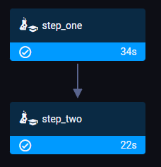
    - 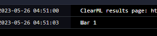
    - 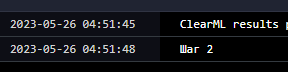
    - 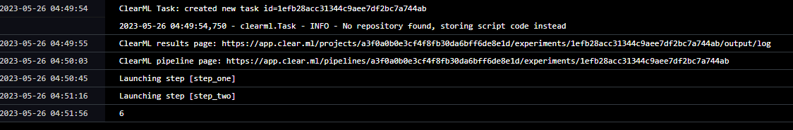
    - Так же, можно следить за всеми передаваемыми и получаемыми параметрами.
        - 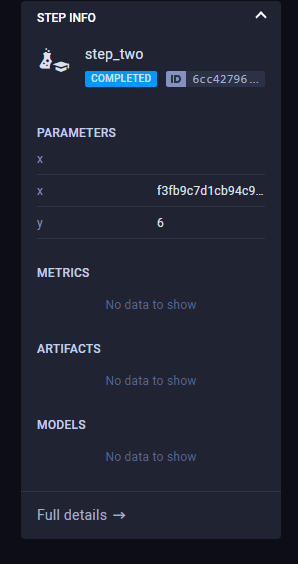


## Примеры работы пайплайна
- Рассмотрим пайплайн на результатах секвенирования с > 90% mapped
    - В дашборде ClearML можно увидеть такой граф, который соответствует очередности запуска шагов пайплайна. Как можно заметить, 
    программа обошла пункт `fault_exit`
        - 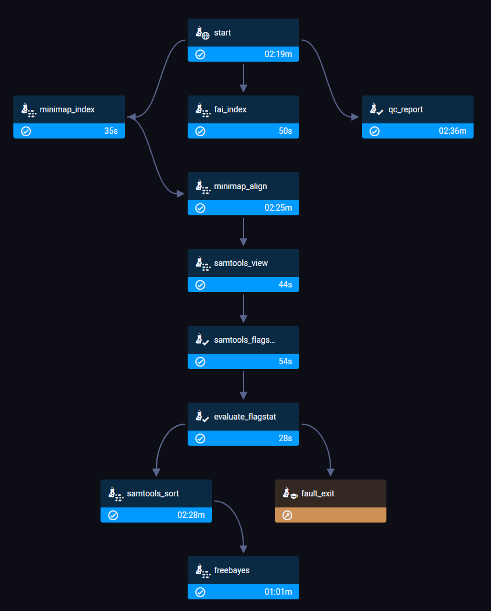
    - Логи на клиенте и в дашборде разнятся, поскольку на сервер не пересылается аутпут из exec. Так же в дашборде логи пайплайна и логи шага разделены.
    На картинке ниже показаны логи пайплайна.
        - 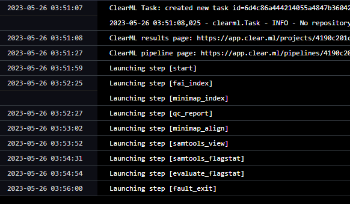
    - А это логи шага 
        - 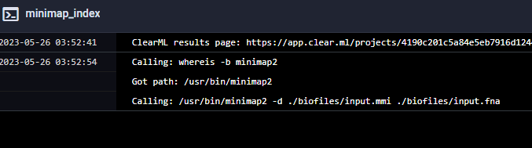
    - Так же у пайплайна есть конфигурация, с которой он запускается. При помощи неё можно запускать задачи прямо с дашборда и они автоматически будут исполняться (в случае использования агентов).
        - 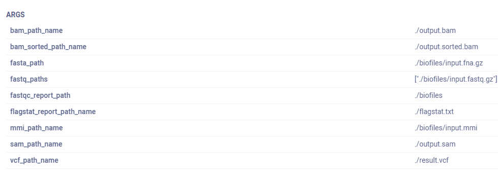
- Плохие данные < 90% mapped
    - В конфигурации запуска пайплайна меняется fastq_paths 
        - 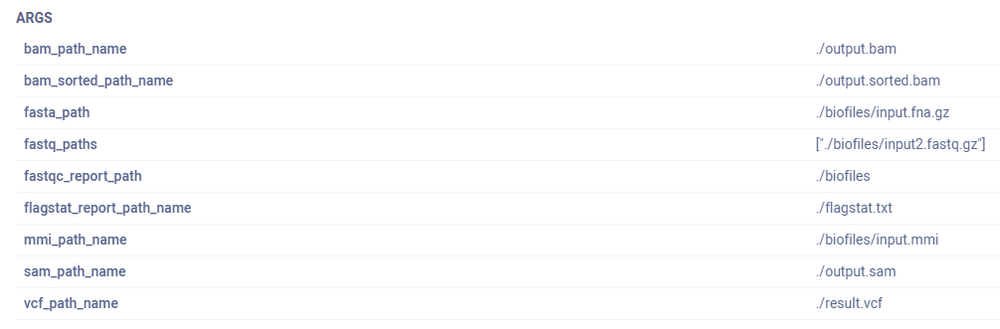
    - И граф не будет заходить на 2 последних шага, а пропустит их 
        - 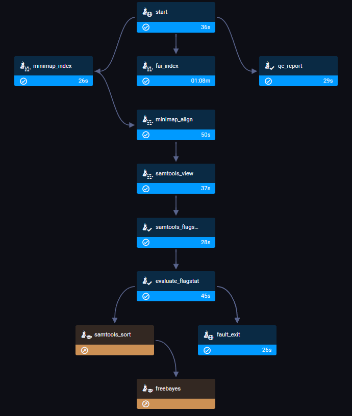


## Отличия
Отличий схемы работы пайплайна от блок-схемы особо нет, кроме шага с .fai индексом.
